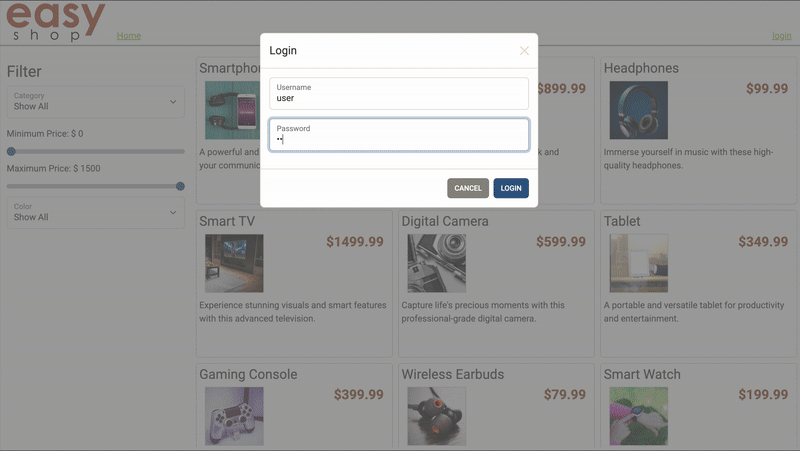

# Easy Shop

## Description of the Project

EasyShop is a Spring Boot-based e-commerce application developed as a backend capstone project. 
The project simulates a real-world online store, allowing users to browse products, manage shopping carts, and place orders. 
In this application we also focus on the upgrade of an existing system and enhancing core backend functionalities.
## User Stories

- As an admin, I want to be able to perform CRUD operations on product categories, so I can manage the catalog
- As a customer, I want accurate product search results when using filters so that I can find relevant products
- As an admin, I want product updates to replace the existing product instead of creating duplicates, so product data stays clean
- As a logged-in user, I want to manage items in my shopping cart so that I can prepare my order for checkout
- As a logged-in user, I want to view and update my profile so I can keep my personal information accurate
- As a logged-in user, I want to place an order using my shopping cart so that I can complete my purchase

## Setup

1. Clone the Repository
    1. git clone https://github.com/sharad101/EasyShop-Capstone.git
    2. cd capstone-starter

2. Open/Launch in IntelliJ IDEA
   Launch IntelliJ IDEA
    1. Click File > Open
    2. Select the project folder you just cloned

3. Configure Project
    1. Go to File > Project Structure

4. Build and Run the Project
    1. Open the main class file (EasyshopApplication.java)
    2. Right-click on it and select Run 'EasyshopApplication.main()'
   

5. Run the Project
   1. Open the main class file (capstone-client-web-application)
   2. Right-click on it and select Run 'index.html'
   3. Open the frontend application on a web browser

### Prerequisites

- IntelliJ IDEA: Ensure you have IntelliJ IDEA installed, which you can download from [here](https://www.jetbrains.com/idea/download/).
- Java SDK: Make sure Java SDK is installed and configured in IntelliJ.

### Running the Application in IntelliJ

Follow these steps to get your application running within IntelliJ IDEA:

1. Open IntelliJ IDEA.
2. Select "Open" and navigate to the directory where you cloned or downloaded the project.
3. After the project opens, wait for IntelliJ to index the files and set up the project.
4. Find the main class with the `public static void main(String[] args)` method.
5. Right-click on the file and select 'Run 'YourMainClassName.main()'' to start the application.

## Technologies Used

- Java 17

## Demo

## Interesting Code

      
    // add a POST method to add a product to the cart - the url should be
    // https://localhost:8080/cart/products/15 (15 is the productId to be added)
    @PostMapping("/products/{productId}")
    public ShoppingCart addProductToCart(@PathVariable int productId, Principal principal)
    {
        try
        {
            int userId = getCurrentUserId(principal);

            Product product = productDao.getById(productId);
            if (product == null)
                throw new ResponseStatusException(HttpStatus.NOT_FOUND, "Product not found.");

            // Check if product already exists in cart
            if (shoppingCartDao.isProductInCart(userId, productId))
            {
                // Increment quantity by 1
                shoppingCartDao.incrementQuantity(userId, productId);
            }
            else
            {
                // Add new product with quantity 1
                shoppingCartDao.addProduct(userId, productId, 1);
            }

            // Return the updated shopping cart
            return shoppingCartDao.getByUserId(userId);
        }
        catch (Exception e)
        {
            e.printStackTrace();
            throw new ResponseStatusException(HttpStatus.INTERNAL_SERVER_ERROR, "Unable to add product to cart.");
        }
    }

Purpose: This method enables users to add a product to their cart. If the item is already there, it increases the quantity. If it's new, it adds it with a quantity of 1.

## Future Work
In the future features I would add is Phase 5. When a user is ready to check out you need to convert their shopping cart into an
order. Once the order has been created you should clear the shopping cart. Implement a checkout button for this implementation.

## Resources

List resources such as tutorials, articles, or documentation that helped you during the project.

- Raymond's Notes
- Potato Sensei

## Thanks

Express gratitude towards those who provided help, guidance, or resources:

- Thank you to Raymond for continuous support and guidance.

 